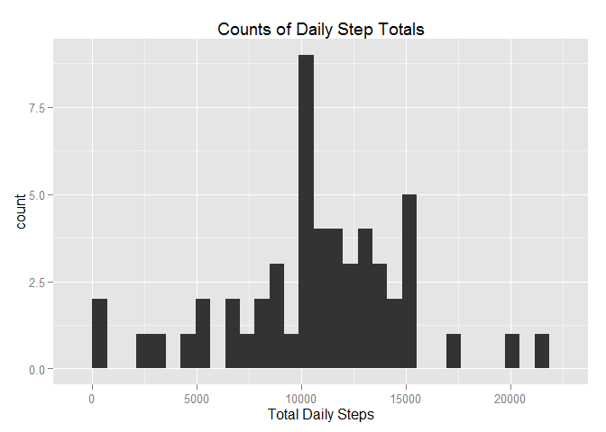
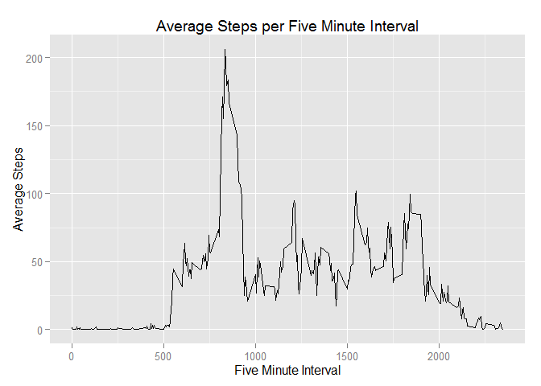
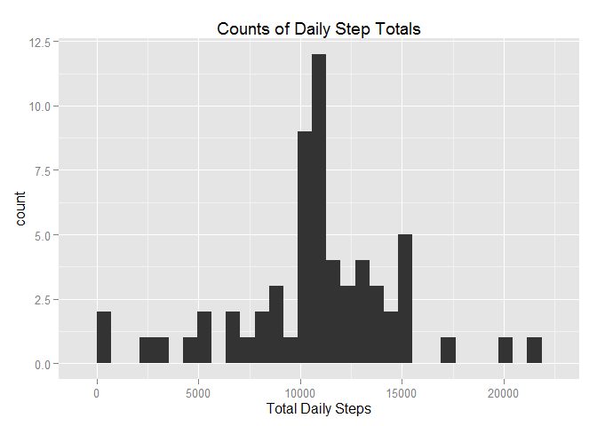
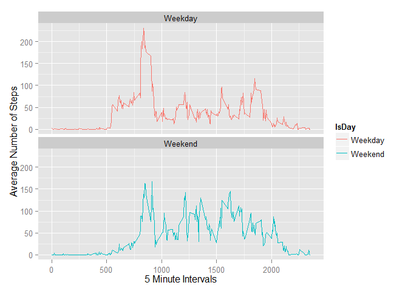

# Reproducible Research: Peer Assessment 1
R. Black  
Sunday, November 11, 2014  
The purpose of this study is to answer several questions regarding steps taken by one individual wearing an activity monitoring device. This device collected motion data at 5 minute intervals daily for two months.  These data were collected during October and November, 2012. 

<ul>
<li>The original collected dataset used for this study is published here: (https://d396qusza40orc.cloudfront.net/repdata%2Fdata%2Factivity.zip).</li>
<li>For this study, the dataset was downloaded on 10/17/2014.</li>
</ul>
The questions to answer are:
<ol>
<li>What are the mean and median steps per day?</li>
<li>What is the average daily pattern?</li>
<li>How to handle missing values using approximations?  What impact does this technique have our our studies?</li>
<li>Are there differences in activity patterns between weekdays and weekends?</li>
</ol>

## Loading and preprocessing the data
<h4>Prep Step: Get data if you need it</h4>

```r
## First step - download if you don't have the file. This code that checks for the dataset and downloads it as necessary.
## Uncomment and run the below lines if you need to get the data
## WD <- getwd()
## if {(!is.null(WD)) setwd(WD)}
## check for dataset, download and unzip as necessary
## if {(!file.exists("activity.csv"))
##         download.file("https://d396qusza40orc.cloudfront.net/repdata%2Fdata%2Factivity.zip", "activity.zip" )
##         
```
<h4>Step 1: Load libraries and pull data into a dataframe for R</h4>

```r
require(knitr)
```

```
## Loading required package: knitr
```

```r
require(reshape2)
```

```
## Loading required package: reshape2
```

```r
require(ggplot2)
```

```
## Loading required package: ggplot2
```

```r
require(plyr)
```

```
## Loading required package: plyr
```

```r
ActivityDF <- read.csv(unz("activity.zip", "activity.csv"), header = TRUE)
```
<hr width="75%"> 
<h4>Question 1a: Make a histogram of the total number of steps taken each day</h4>

```r
options(scipen=999)
TotalStepsDF <- tapply(ActivityDF$steps, ActivityDF$date, FUN=sum, na.rm=FALSE)
qplot(TotalStepsDF, main="Counts of Daily Step Totals", xlab="Total Daily Steps",geom="histogram")
```

```
## stat_bin: binwidth defaulted to range/30. Use 'binwidth = x' to adjust this.
```

 
<h4>Question 1b: What are the mean and median total number of steps taken per day?</h4>

```r
MeanSteps <- mean(TotalStepsDF, na.rm = TRUE)
MedianSteps <- median(TotalStepsDF, na.rm = TRUE)
```
<ul>
<li>The mean total steps per day is 10766.1886792.</li>
<li>The median total steps per day is 10765.</li>
</ul>
<hr width="75%"> 
<h4>Question 2a: What is the average daily pattern?</h4>

```r
## What is the average daily activity pattern?
## create pivot of average steps per interval across all days
FiveMinIntDF<- melt(tapply(ActivityDF$steps, INDEX=ActivityDF$interval, 
                FUN=mean, na.rm=TRUE), 
                variable.name = "interval", value.name = "steps")

# give var1 a meaningful name
names(FiveMinIntDF)[names(FiveMinIntDF)=="Var1"] <- "interval"

ggplot(FiveMinIntDF, aes(interval,steps)) + geom_line(lwd=.4) + 
        scale_x_continuous("Five Minute Interval") + 
        scale_y_continuous("Average Steps") +
        labs(title = "Average Steps per Five Minute Interval")
```

 

<h4>Question 2b: What is the largest average number of steps in a five minute interval?</h4>

```r
MaxSteps <- max(FiveMinIntDF$steps)
TotalMissingStepValues <- sum(is.na(ActivityDF$steps))
```
<ul>
<li>The largest average number of steps in a five minute interval is 206.1698113.</li>
</ul>
<hr width="75%"> 
<h4>Strategy to Handle Missing Values</h4>
<ol>
<li> The total number of missing five minute interval steps per day values is 2304.</li>
<li> Create a copy of ActivityDF dataset called ActivityInferredDF</li>
<li> Use the averages per interval calculated in FiveMinIntDF</li>
<li> Replace the NA's in the ActivityInferredDF dataset with the average steps for that specific interval in FiveMinIntDF</li>
</ol>

```r
#fill in the NA's with averages computed already in FiveMinIntDF
FillInNAsWithAvg <- function(ActivityDF, FiveMinIntDF){
        for (i in 1:nrow(ActivityDF)){
                if (is.na(ActivityDF[i,"steps"])){
                        ActivityDF[i,"steps"] = 
                        round(FiveMinIntDF[as.character(FiveMinIntDF$interval) == 
                        as.character(ActivityDF[i,"interval"]),"steps"])
                }
        }
        ActivityDF   
}
ActivityInferredDF <- FillInNAsWithAvg(ActivityDF, FiveMinIntDF)
```
<hr width="75%"> 
<h4>Question 3: Generate a histogram of the total number of steps taken each day with the inferred data</h4>

```r
options(scipen=999)
TotalInferredStepsDF <- tapply(ActivityInferredDF$steps, ActivityInferredDF$date, FUN=sum, na.rm=FALSE)
qplot(TotalInferredStepsDF, main="Counts of Daily Step Totals", xlab="Total Daily Steps",geom="histogram")
```

```
## stat_bin: binwidth defaulted to range/30. Use 'binwidth = x' to adjust this.
```

 
<ul>
<li>Note: Although the shape of the histogram is the same as before, the count scale is different (higher)</li>
</ul>

<h4>Question 3b: What are the mean and median total number of steps taken per day using the inferred dataset?</h4>

```r
MeanInfSteps <- mean(TotalInferredStepsDF, na.rm = TRUE)
MedianInfSteps <- median(TotalInferredStepsDF, na.rm = TRUE)
```
<ul>
<li>The mean total steps per day with inferred data is 10765.6393443.</li>
<li>The median total steps per day with inferred data is 10762.</li>
<li>Note: inferring the missing data left the mean and median very close to the original value.</li>
</ul>
<h4>Question 3c: What impact did inferring data have?</h4>

```r
summary(TotalStepsDF)
```

```
##    Min. 1st Qu.  Median    Mean 3rd Qu.    Max.    NA's 
##      41    8841   10760   10770   13290   21190       8
```

```r
summary(TotalInferredStepsDF)
```

```
##    Min. 1st Qu.  Median    Mean 3rd Qu.    Max. 
##      41    9819   10760   10770   12810   21190
```
<ul>
<li>The counts of 10,000 and 11,000 step intervals (busy times) increased</li>
<li>The overall shape of the data remained the same</li>
<li>The mean and median remained the same</li>
<li>2,304 cases were inferred as shown below:</li>
</ul>

```r
before<- complete.cases(ActivityDF)
after<- complete.cases(ActivityInferredDF)
table(before)
```

```
## before
## FALSE  TRUE 
##  2304 15264
```

```r
table(after)
```

```
## after
##  TRUE 
## 17568
```
<hr width="75%"> 
<h4>Question 4: Are there differences in activity patterns between weekdays and weekends?</h4>

```r
# Add a factor column to denote weekday or weekend 
ActivityInferredDF$IsDay <- as.factor(ifelse(weekdays(as.Date
                                (ActivityInferredDF$date)) %in% c("Saturday","Sunday"),
                                "Weekend", "Weekday")) 
# ## Recreate dataframe of mean steps per interval with weekday/weekend info
FiveMinIntDF <- aggregate(steps~interval + IsDay, ActivityInferredDF,
                          FUN=mean)

ggplot(data = FiveMinIntDF, aes(x = interval, y = steps, group = IsDay)) + geom_line(lwd=.3) + 
        geom_line(aes(color = IsDay)) +
        facet_wrap(~ IsDay, nrow=2) + 
        scale_x_continuous("5 Minute Intervals") + 
        scale_y_continuous("Average Number of Steps")
```

 
<ul>
<li>There is more activity on the weekends</li>
</ul>
